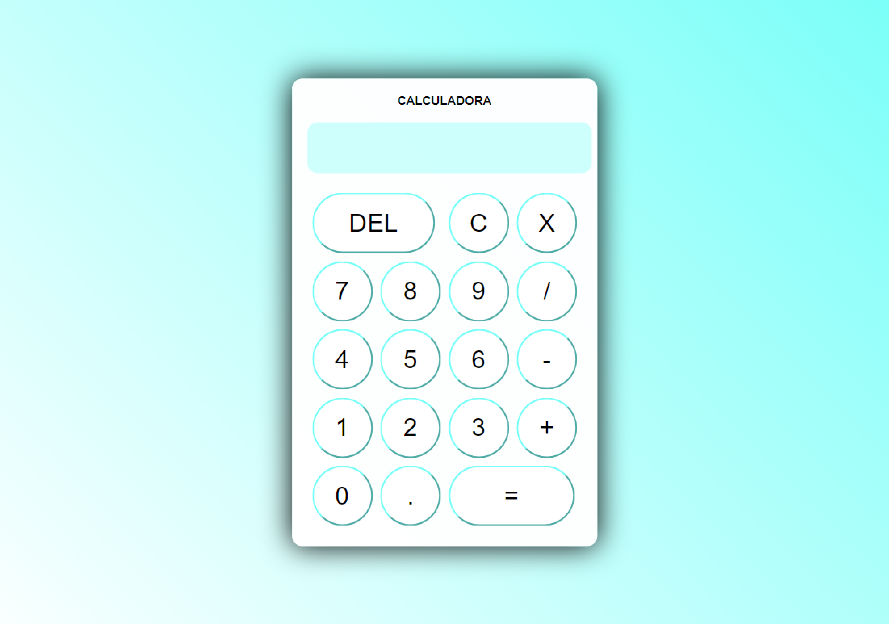

<h1 align='center'>Calculadora com HTML, CSS e JavaScript</h1>

<a href='#-tecnologias'>Tecnologias</a>&nbsp;&nbsp;&nbsp;|&nbsp;&nbsp;&nbsp;
<a href='#-projeto'>Projeto</a>

  

 

  

 

## 🚀 Tecnologias

- HTML
- CSS
- JavaScript

## 💻 Projeto

- [Acesse o projeto finalizado online](https://gabriellytegon.github.io/calculator/)

---